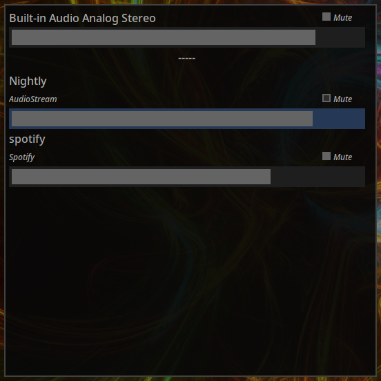

# WlPaVUOverlay

WlPaVUOverlay is a simple utility for quickly changing PulseAudio (and PipeWire) volume levels.
Made exclusively for Wayland compositors. Preferably those that support `wlr-layer-shell`.
## Warning!
I'm doing this to learn, so the code is horrible in many ways. You probably shouldn't use this as a learning resource, unless it's to learn how not to do things.
## Usage
Just run `wlpavuoverlay` and it'll use layer-shell to show itself over everything. If layer-shell isn't available it falls back to xdg-shell.
You can add arguments to change the behaviour.
* `xdg` or `-x` - Use xdg-shell even if layer-shell is available.
* `dim` or `-d` - "Fullscreen" mode. This makes mouse usage easier if another surface has locked or hidden the pointer. Only with layer-shell.
* `pw` or `-p` - Use PipeWire instead of PulseAudio.
* `shm` or `-s` - Use software rendering instead of GL. Not sure why you'd want this...
* `-w _width_` - Set surface width.
* `-h _height_` - Set surface height.

There are currently hardcoded keyboard commands..
* **j🠯 k🠭** - move down / up
* **h🠬 l🠮** - adjust selected volume lower / higher, hold shift for a larger adjustment
* **m** - toggle mute on selected
## Compiling
This is a simple Meson project, so the good old `meson build` `ninja -C build` is a good start.

This uses my own little nwl library. If you're just using Meson defaults it should automatically fetch it for you. If you prefer you can grab and install [nwl](https://github.com/udfn/nwl/) separately. But that's not recommended.
### Dependencies
Many, but you probably already have most of these...
* A working C compiler
* Epoxy
* Wayland (obviously)
* Cairo (RIP)
* EGL & GL
* Xkbcommon
* PulseAudio
* PipeWire (optional)
## TODO (in no particular order and will probably not be done)
- [ ] Handle recording devices & streams
- [ ] Clean up the code
- [ ] Touch input support
- [ ] Better interface toolkit
- [ ] Support volumes over 100%
- [ ] Adjust individual channels
- [ ] Rewrite in whatever language is hot this month
- [ ] Changing stream sinks & sources and defaults
- [ ] Keyboard input - Partially done
- [ ] Proper multiseat support
- [ ] Fractional scaling (how? Wayland only allows integer scales for buffers)
- [x] Generate the protocol headers & code during build
- [ ] Audio level meters, like `pavucontrol`
- [x] PipeWire support
- [ ] Advanced PipeWire features (graph view, video streams, etc..)
